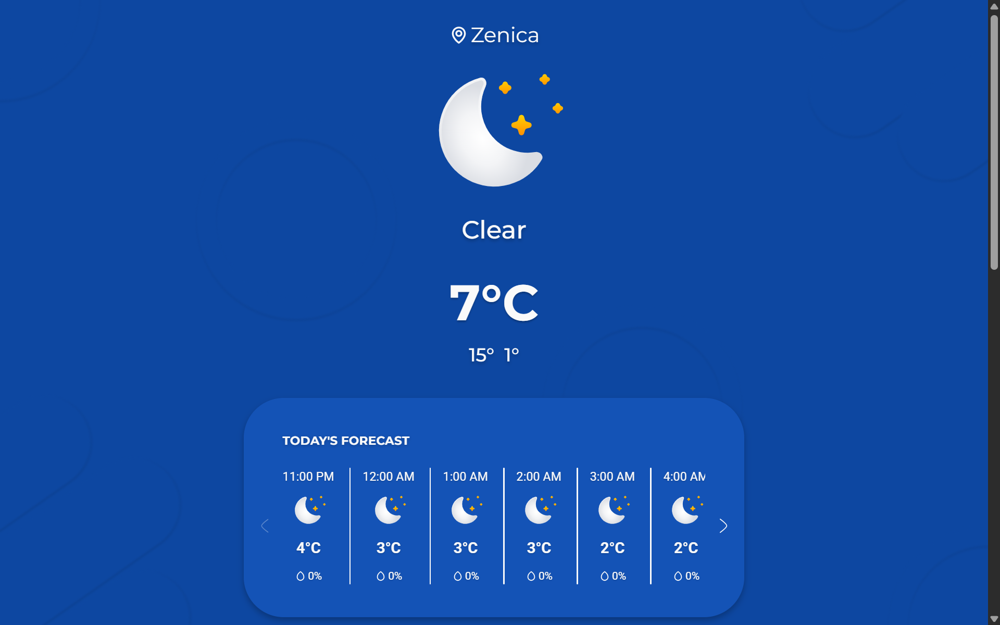

# 🌤️ Weather App

<p align="center">
  
  
  
</p>

A modern, interactive **Weather App** that provides real-time weather information for cities around the world.
Search for any location and instantly see current weather conditions with a clean and responsive interface.
Stay informed with temperature, weather conditions, and more — all in a simple, user-friendly design.
<br><br>

<p align="center">
     
</p>

## 🖥️ Demo

<br>

🌐 **Try it now:** [https://weather-app-psi-five-97.vercel.app/](https://weather-app-psi-five-97.vercel.app/)

---

## Table of Contents 📑

- [How to use ☁️](#how-to-use-)
- [Features ✨](#features-)
- [Technologies Used 🛠️](#technologies-used)
- [Installation & Setup 📥](#installation-&-setup)
- [Author 👤](#author-)
- [License 📄](#license-)

---

## How to use 📖

1. Open the webpage in your **browser**.
2. Your browser will ask for **location permission**.
3. After allowing access, the app will display the **weather conditions for your current location**.
4. Click on the **city name** to change the location.
5. Enter a **city name** in the search bar and select it from the results.
6. Press the **OK** button to display the weather for the selected city.

---

## Features ✨

- 🌍 Search weather by **city name**
- 🌡️ View **current temperature, humidity, wind speed, UV index, visibility, and AQI**
- 📅 See **24-hour and 7-day weather forecasts**
- 🌙 Display **moon phase, sunrise, and sunset times**
- ☀️ Animated **sun position indicator**
- 🌤️ Dynamic weather icons based on current conditions
- 📱 Fully **responsive design** for desktop and mobile devices
- 🌐 Fetches **real-time data from a weather API**

<h2 id="technologies-used">Technologies Used 🛠️</h2>

| Technology      | Purpose                                 |
| --------------- | --------------------------------------- |
| ⚛️ React.js     | Component-based UI and state management |
| ⚡ Vite         | Fast development server and build tool  |
| 🎨 Tailwind CSS | Styling and responsive layout           |
| 🌐 HTML5        | Basic page structure                    |
| 📝 JavaScript   | App logic and interactivity             |
| 🟢 Node.js      | Backend server                          |

---

<h2 id="installation-&-setup">Installation & Setup 📥</h2>

1. **Install Node.js**
   <br>

   Make sure **Node.js** is installed on your system. You can download it from [https://nodejs.org/](https://nodejs.org/).

2. **Clone the repository**:

```bash
git clone git@github.com:CamdzicAlden/WeatherApp.git
```

3. **Navigate to the frontend folder**:

```bash
cd frontend
```

4. **Install frontend dependencies**:

```bash
npm install
```

5. **Start the frontend development server**:

```bash
npm run dev
```

6. **Navigate to the backend folder**:

```bash
cd backend
```

7. **Install backend dependencies**:

```bash
npm install
```

8. **Configure local development**:

Change the CORS origin in `server.js` and set the API domain to `localhost` in `weatherapi.js` to run the project locally.

9. **Add your API key**

- Go to [https://www.weatherapi.com/signup.aspx](https://www.weatherapi.com/signup.aspx) and sign up first.

- Go to your profile and copy your **API** key

- Make `.env` file in `backend` folder and make two variables: <br>

```bash
API_KEY = "place your API key here"
PORT = 5000
```

9. **Start the backend server**:

```bash
node server.js
```

10. **Open the provided local URL** (usually http://localhost:5173) and start exploring!

---

## Future Improvements 🔮

- Improve weather **data quality** by integrating a paid weather API

- Add additional in-app **features** (running conditions, pollen levels, etc.)

- Upgrade hosting infrastructure to **improve loading speed**

---

## Author 👤

**Alden Čamdžić**

---

## License 📄

<i>This project is open-source and free to use for educational purposes.</i>
